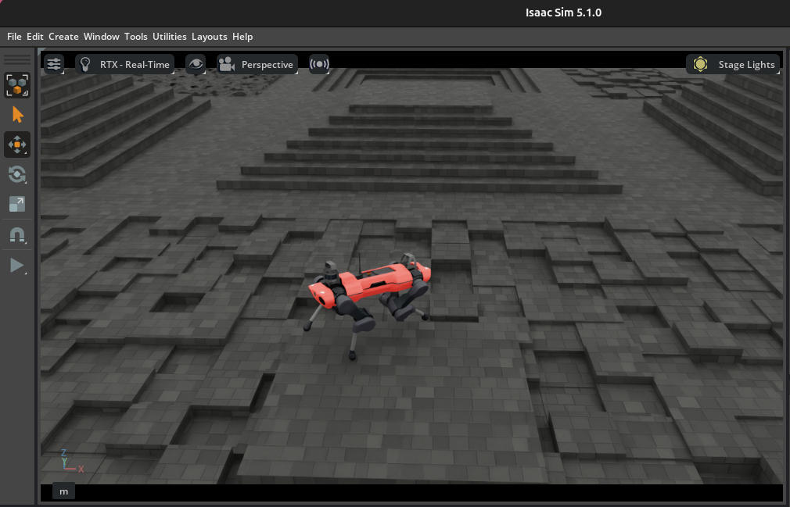
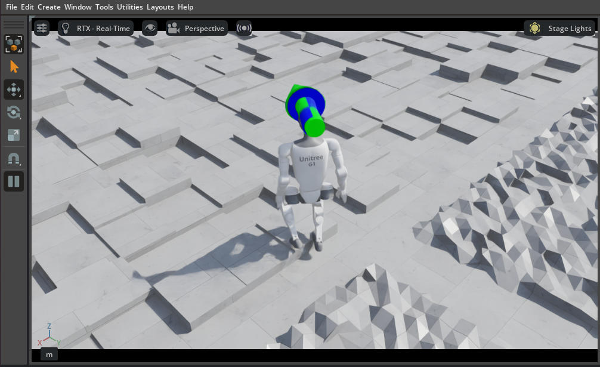

# Isaac Lab Experience

NVIDIA Isaac Sim 和 Isaac Lab 学习与实践项目，包含完整的机器人仿真、强化学习和运动规划示例。

---

## ✨ VLA 推理实测：LeIsaac SO-101 PickOrange
_VLA Inference Benchmark on LeIsaac SO-101 PickOrange_

https://github.com/user-attachments/assets/44205148-1fa0-4b33-8f60-7a079faf9840

把多个开源 VLA（视觉-语言-动作）模型通过远程推理服务接入 LeIsaac SO-101 单臂 Isaac Sim 仿真，对比同一 PickOrange 任务下的表现，并自训了一套 ACT / Diffusion Policy / SmolVLA / π0.5 LoRA 用于横评。
_Compare open-source VLA policies on the same SO-101 PickOrange task via remote inference servers; complemented by our own fine-tuned ACT / Diffusion Policy / SmolVLA / π0.5 LoRA checkpoints._

- **任务 / Task**：`Pick up the orange and place it on the plate`
- **机器人 / Robot**：SO-101 follower（6 DOF：5 关节 + gripper）
- **观测 / Observation**：双相机（front + wrist，480×640 RGB）+ 关节状态 / dual-cam RGB + joint state
- **入口 / Entry point**：📓 [LeIsaac.ipynb](./LeIsaac.ipynb)（每个子章节都是「下载 → 启 server → 跑推理」一键 cell）

### 已接入的 VLA 模型
_Integrated VLA models_

| 子章节 | 模型 ckpt                                                                                                    | 类型                                                | server                          | port | 状态 / Result        |
| ------ | ------------------------------------------------------------------------------------------------------------ | --------------------------------------------------- | ------------------------------- | ---- | -------------------- |
| §1    | [`hi-space/GR00T-N1.6-3B-Pick-Orange`](https://huggingface.co/hi-space/GR00T-N1.6-3B-Pick-Orange)             | GR00T N1.6（3B，flow-matching action head）         | `run_gr00t_server.py`         | 5555 | ✅ **3/3 实测成功 / pass** |
| §2    | [`LightwheelAI/leisaac-pick-orange-v0`](https://huggingface.co/LightwheelAI/leisaac-pick-orange-v0)           | GR00T N1.5（3B，DiT diffusion action head）         | `inference_service.py`        | 5555 | ✅ **3/3 实测成功 / pass，~30s 完成** |
| §3    | [`shadowHokage/act_policy`](https://huggingface.co/shadowHokage/act_policy)                                   | ACT（~80M，纯 vision + state → action chunk）      | LeRobot async `policy_server` | 8080 | ✅ **1/1 实测成功 / pass** |
| §3    | [`edge-inference/smolvla-so101-pick-orange`](https://huggingface.co/edge-inference/smolvla-so101-pick-orange) | SmolVLA（~450M，SmolVLM2 backbone + Action Expert） | LeRobot async `policy_server` | 8080 | ⚠️ 2/5 单颗即翻车 / fails on 1st orange |
| §3    | [`wsagi/DiffusionPolicy-PickOrange`](https://huggingface.co/wsagi/DiffusionPolicy-PickOrange) **（自训 / ours）** | Diffusion Policy（~267M，ResNet18 vision + UNet 1D + DDIM swap） | LeRobot async `policy_server` | 8080 | ⚠️ 1-2/3，DDIM32 hot-swap 后可控；第三颗 OOD / fails on 3rd |
| §4    | [`hi-space/GR00T-N1.7-3B-Pick-Orange`](https://huggingface.co/hi-space/GR00T-N1.7-3B-Pick-Orange)             | GR00T N1.7（3B）                                    | `run_gr00t_server.py` (N1.7)  | 5555 | ⛔ 推理 infra 未搭 / not wired   |

GR00T 系列三条共用 ZMQ :5555，任一时刻只能跑一个；§3 LeRobot async server 在独立的 :8080（ACT / SmolVLA / DP 复用同一 server，按 ckpt 切换），可与 GR00T 共存。
_GR00T variants share ZMQ :5555 (one-at-a-time); LeRobot async server on :8080 hosts ACT / SmolVLA / DP via runtime ckpt switching and coexists with GR00T._

### 实测结论 — 共同 OOD bottleneck
_Test results — shared OOD bottleneck_

三个独立架构（**ACT 回归 / SmolVLA VLM / DP 扩散**）在 60-episode `leisaac-pick-orange` 数据集上都卡在 **第三颗橙子 / late second**：每集只有 1 次"放最后一颗"演示，三个模型共同 OOD。**不是单一模型问题**，是数据分布问题。
_Three independent architectures (ACT regression / SmolVLA VLM / DP diffusion) all stall on the **3rd orange / late 2nd** when fine-tuned on the 60-episode `leisaac-pick-orange` dataset — a shared OOD bottleneck driven by only one "place last orange" demo per episode, not a per-model failure._

- **DP 推理速度根因 / DP latency root cause**：DDPM 100-step 串行采样（不是模型大）。无重训直接 `noise_scheduler_type: DDPM → DDIM` + `num_inference_steps: 32` hot-swap，inference 393ms → 147ms，slowdown 2.96x → 1.1x，4090 上跑得动。
  _DP slowness ≠ model size, but DDPM 100-step serial sampling. Hot-swap ckpt config `DDPM → DDIM` (32 steps) without retraining: 393→147 ms/chunk, 2.96x→1.1x slowdown, real-time on RTX 4090._
- **Eval timeout 哲学 / Timeout philosophy**：`user_patience_cap = startup + n_rounds × 90s`（GR00T baseline 30s × 3 容差），不按推理速度放水。慢模型 = 不适合实时部署，让它失败就好。
  _Use a user-patience cap (`startup + n_rounds × 90s`), not an inference-stretched budget. Slow models should fail-fast as a deployability signal, not be accommodated._
- **设计文档 / Design docs**（in our LeIsaac fork [vitorcen/LeIsaac](https://github.com/vitorcen/LeIsaac)）：
  - [`docs/training/dp_inference_speedup_and_dynamic_timeout.html`](https://github.com/vitorcen/LeIsaac/blob/main/docs/training/dp_inference_speedup_and_dynamic_timeout.html) — DDIM swap + 动态 timeout 完整 postmortem（含 SVG 拟合曲线）
  - [`docs/training/act_eval_debug_postmortem.html`](https://github.com/vitorcen/LeIsaac/blob/main/docs/training/act_eval_debug_postmortem.html) — ACT eval 三个 sim-side 根因 (sim_warmup / step_hz / action_horizon)

### 自训配方与脚本
_Our training recipes and scripts — see [vitorcen/LeIsaac](https://github.com/vitorcen/LeIsaac) fork_

| 模型 / Model | 训练入口 / Launcher (in fork)                              | 关键配方 / Recipe                                            |
| ------------ | ---------------------------------------------------------- | ------------------------------------------------------------ |
| ACT          | `scripts/training/act/train.sh`                            | chunk_size=100, batch=8, lr=1e-5, 10k steps, no augmentation |
| DP           | `scripts/training/diffusion_policy/train.sh`               | UNet 1D + ResNet18 vision，**train-from-scratch**，DDIM 32-step inference |
| SmolVLA      | `scripts/finetune/smolvla/prepare_base.sh` → `scripts/finetune/lerobot_finetune.sh` | finetune SmolVLM2 backbone，60 ep 不够拟合 / underfit         |
| π0.5         | `scripts/finetune/openpi/pytorch/train.sh`                 | LoRA on Gemma-2B 主干，cumulative 5000 + phased sampler 续训 |

> 训练目录按语义分：`scripts/finetune/` = 有 pretrained base（fine-tune），`scripts/training/` = 从头训练（train-from-scratch）。
> _Convention: `scripts/finetune/` = fine-tune from a pretrained base; `scripts/training/` = train-from-scratch._

### 推理基础设施
_Inference infrastructure_

- **HF 默认 cache**：所有 ckpt 落 `~/.cache/huggingface/hub/`，`AutoModel.from_pretrained("repo_id")` 直接命中
- **统一 server 管理**：`scripts/policy_server.sh start|stop {gr00t-n15|gr00t-n16|lerobot} [MODEL_PATH]`
- **通用 HF 下载器**：`scripts/download_hf_model.sh REPO_ID`（基于 `hf download`，幂等）
- **client 端自动适配**：`policy_inference.py` 会读 ckpt 的 `config.json` 推断 image feature 名字，避免 SmolVLA base 时代的 `camera1/2/3` 硬编码污染 fine-tune 路径
- **LeIsaac submodule patch 维护**：`patches/leisaac/*.patch` + `scripts/apply_leisaac_patches.sh`（幂等 apply）

详细命令、坑点、conda env 配置见 [`scripts/README.md`](./scripts/README.md)。

---

## 快速体验（无需训练）

无需训练，直接运行预训练策略观察机器人行为。

### 🦎 四足机器人 — ANYmal-C 在崎岖地形行走



### 🚶 人形机器人 — Unitree G1 行走



### 其他可用演示

- **倒立摆平衡**（Cartpole）：经典控制任务，最快上手
- **四足运动**：ANYmal-C/D、Ant、Unitree A1/Go1/Go2
- **人形运动**：Unitree G1/H1、Humanoid、AMP 基于运动先验的自然运动
- **灵巧手操作**：Shadow Hand、Allegro Hand 物体操作
- **机械臂任务**：Franka 开柜子
- **飞行器**：Quadcopter 悬停和位置控制

### 一键运行

```bash
conda activate isaaclab
cd IsaacLab && python scripts/reinforcement_learning/rsl_rl/play.py \
    --task Isaac-Cartpole-Direct-v0 \
    --use_pretrained_checkpoint \
    --num_envs 64
```

快速体验（预训练策略，无需训练）：

- 📓 [LeIsaac.ipynb](./LeIsaac.ipynb) — **LeIsaac SO-101 PickOrange VLA 推理对比**（GR00T N1.5/N1.6/N1.7 + LeRobot ACT/SmolVLA）
- 📓 [DEMO.ipynb](./DEMO.ipynb) — 通用 server 后台启动 + GR1 robocasa tabletop demo

完整演示列表和使用说明见：

- 📘 [SCRIPTS.md](./SCRIPTS.md) — Markdown 文档
- 📓 [SCRIPTS.ipynb](./SCRIPTS.ipynb) — 可直接执行的 Jupyter notebook

---

## 核心功能

### Isaac Lab

- **机器人模型库**: 16+ 常见机器人模型（机械臂、四足、人形等）
- **预配置环境**: 30+ 可直接训练的强化学习环境
- **物理仿真**: 刚体、铰接系统、可变形物体
- **传感器**: RGB/深度/分割相机、IMU、接触传感器、光线投射器
- **RL 框架集成**: RSL RL、SKRL、RL Games、Stable Baselines
- **多智能体支持**: 多智能体强化学习

### Isaac Sim

- **资产导入**: URDF、MJCF、CAD 格式支持
- **机器人调优**: 物理精度、计算效率、真实感优化
- **机器人仿真**: 控制器、运动生成、运动学求解器
- **RTX 传感器**: 基于光线追踪的高保真传感器仿真
- **ROS 集成**: ROS/ROS2 桥接支持
- **合成数据生成**: 用于训练 AI 模型的数据生成工具

---

## 系统要求

### 硬件要求

**本地工作站（最低配置）**：

- GPU: NVIDIA RTX 4080 或更高
- 推荐: RTX 5080 / RTX 5880 Ada
- 最佳: RTX PRO 6000 Blackwell Workstation

**数据中心（最低配置）**：

- GPU: NVIDIA A40 或更高
- 推荐: L40S / L20
- 最佳: RTX PRO 6000 Blackwell Server

### 软件要求

- **操作系统**: Ubuntu 22.04 / Ubuntu 24.04（需要 GCC/G++ 11）
- **Python**: 3.11
- **驱动**: 最新 NVIDIA 驱动（参考 [NVIDIA 驱动要求](https://docs.omniverse.nvidia.com/dev-guide/latest/common/technical-requirements.html)）
- **Git** 和 **Git LFS**
- **build-essential**: 包含 make 等构建工具

---

## 安装依赖

### 1. 安装基础工具

```bash
sudo apt-get update
sudo apt-get install build-essential
sudo apt-get install git-lfs
git lfs install
```

### 2. 安装 GCC/G++ 11（Ubuntu 24.04 必需）

```bash
sudo apt-get install gcc-11 g++-11
sudo update-alternatives --install /usr/bin/gcc gcc /usr/bin/gcc-11 200
sudo update-alternatives --install /usr/bin/g++ g++ /usr/bin/g++-11 200
```

### 3. 验证编译器版本

```bash
gcc --version
g++ --version
```

---

## 快速开始

有两种安装方式：**pip 安装（推荐）** 或 **源码构建**。

### 方式一：pip 安装 Isaac Sim（推荐）

这是最简单快速的方式，使用 NVIDIA 官方的 pip 包。

#### 1. 克隆项目

```bash
git clone <your-repo-url> isaaclab-experience
cd isaaclab-experience
```

#### 2. 初始化 IsaacLab Submodule

```bash
git submodule update --init --recursive IsaacLab
```

#### 3. 创建 Conda 环境

Isaac Sim 需要 Python 3.11：

```bash
conda create -n isaaclab python=3.11 -y
conda activate isaaclab
```

#### 4. 安装 Isaac Sim pip 包

```bash
pip install isaacsim-rl isaacsim-extscache-physics isaacsim-extscache-kit-sdk isaacsim-extscache-kit \
    --extra-index-url https://pypi.nvidia.com
```

> **重要**：
>
> - 确保 conda 环境已激活
> - 首次安装会下载约 5-10 GB 数据，需要稳定网络
> - 安装时间取决于网络速度，通常 10-30 分钟

#### 5. 安装 Isaac Lab

```bash
cd IsaacLab
./isaaclab.sh --install
```

#### 6. 验证安装

```bash
python scripts/reinforcement_learning/rsl_rl/train.py --task Isaac-Cartpole-Direct-v0
```

---

### 方式二：源码构建 Isaac Sim

如果需要修改 Isaac Sim 源码，使用此方式。

#### 1. 克隆项目并初始化所有 Submodules

```bash
git clone <your-repo-url> isaaclab-experience
cd isaaclab-experience
git submodule update --init --recursive
```

#### 2. 构建 Isaac Sim

```bash
cd IsaacSim
./build.sh
```

> 注意：
>
> - 构建需要互联网连接
> - 需要 20+ GB 磁盘空间
> - 构建时间：1-3 小时（首次）

#### 3. 创建符号链接

构建完成后，需要在 IsaacLab 中创建指向 Isaac Sim 构建输出的符号链接：

```bash
cd ../IsaacLab
ln -s ../IsaacSim/_build/linux-x86_64/release _isaac_sim
```

#### 4. 安装 Isaac Lab

```bash
./isaaclab.sh --install
```

#### 5. 验证安装

```bash
./isaaclab.sh -p scripts/reinforcement_learning/rsl_rl/train.py --task Isaac-Cartpole-Direct-v0
```

---

## 项目结构

```
isaaclab-experience/
├── IsaacLab/                  # Isaac Lab 源码（submodule）
│   ├── source/                # 核心源码
│   ├── apps/                  # 应用程序
│   └── docs/                  # 文档
└── IsaacSim/                  # Isaac Sim 源码（submodule）
    ├── source/                # 核心源码
    ├── tools/                 # 工具集
    └── docs/                  # 文档
```

---

## 官方文档

### Isaac Lab

- [官方文档](https://isaac-sim.github.io/IsaacLab)
- [安装指南](https://isaac-sim.github.io/IsaacLab/main/source/setup/installation/index.html)
- [强化学习教程](https://isaac-sim.github.io/IsaacLab/main/source/overview/reinforcement-learning/rl_existing_scripts.html)
- [可用环境列表](https://isaac-sim.github.io/IsaacLab/main/source/overview/environments.html)
- [API 文档](https://isaac-sim.github.io/IsaacLab/main/source/api/index.html)

### Isaac Sim

- [官方文档](https://docs.isaacsim.omniverse.nvidia.com/latest/index.html)
- [快速入门教程](https://docs.isaacsim.omniverse.nvidia.com/5.1.0/introduction/quickstart_index.html)
- [资产库](https://docs.isaacsim.omniverse.nvidia.com/5.1.0/assets/usd_assets_overview.html)
- [ROS2 集成](https://docs.isaacsim.omniverse.nvidia.com/5.1.0/ros2_tutorials/ros2_landing_page.html)

---

## 常见问题

### Conda 环境冲突导致 cmake 错误

**现象**：运行 `./isaaclab.sh --install` 时出现 `ModuleNotFoundError: No module named 'cmake'`。

**原因**：conda 环境中的 cmake 包装器与系统 cmake 冲突。

**解决方案**：

1. **方案一（推荐）**：确保 conda 环境已激活

   ```bash
   conda activate isaaclab
   cd IsaacLab
   ./isaaclab.sh --install
   ```
2. **方案二**：如果仍然失败，临时退出 conda 使用系统环境：

   ```bash
   conda deactivate
   # 注意：只有在 pip 安装方式下才需要 conda 环境
   ```

### Isaac Lab 找不到 Isaac Sim 环境

**现象**：提示 `Unable to find any Python executable at path: '_isaac_sim/python.sh'`。

**原因**：Isaac Sim 未安装或 conda 环境未激活。

**解决方案**：

- **pip 安装**：确保已安装 `isaacsim-rl` 且 conda 环境已激活

  ```bash
  conda activate isaaclab
  pip list | grep isaacsim
  ```
- **源码构建**：确保 IsaacSim 已构建完成

  ```bash
  cd IsaacSim
  ./build.sh
  ```

### 编译器版本问题（源码构建）

如果构建时提示编译器版本不兼容，可以：

1. **使用 GCC/G++ 11**（推荐）
2. **跳过版本检查**（风险自负）：
   ```bash
   ./build.sh --skip-compiler-version-check
   ```

### Submodule 未初始化

如果运行脚本时提示找不到目录：

```bash
git submodule update --init --recursive
```

### GPU 驱动问题

确保安装了最新的 NVIDIA 驱动（推荐 550+）：

```bash
nvidia-smi
sudo apt-get install nvidia-driver-550 nvidia-utils-550
```

如果显示错误，参考 [NVIDIA 驱动安装指南](https://docs.nvidia.com/datacenter/tesla/tesla-installation-notes/index.html)。

---

## Docker 支持

使用 Docker 可以避免环境配置问题：

### 安装 Docker 和 NVIDIA Container Toolkit

```bash
curl -fsSL https://get.docker.com -o get-docker.sh
sudo sh get-docker.sh
sudo usermod -aG docker $USER

distribution=$(. /etc/os-release;echo $ID$VERSION_ID)
curl -s -L https://nvidia.github.io/nvidia-docker/gpgkey | sudo apt-key add -
curl -s -L https://nvidia.github.io/nvidia-docker/$distribution/nvidia-docker.list | sudo tee /etc/apt/sources.list.d/nvidia-docker.list

sudo apt-get update
sudo apt-get install -y nvidia-container-toolkit
sudo systemctl restart docker
```

### 使用 Docker 运行

参考 IsaacLab 和 IsaacSim 目录中的 Docker 相关文档。

---

## 版本兼容性

| Isaac Lab 版本 | Isaac Sim 版本  |
| -------------- | --------------- |
| `main` 分支  | 4.5 / 5.0 / 5.1 |
| `v2.3.X`     | 4.5 / 5.0 / 5.1 |
| `v2.2.X`     | 4.5 / 5.0       |

---

## 贡献

欢迎提交 Issue 和 Pull Request！

- **Isaac Lab**: [贡献指南](https://isaac-sim.github.io/IsaacLab/main/source/refs/contributing.html)
- **Isaac Sim**: [GitHub Issues](https://github.com/isaac-sim/IsaacSim/issues)

---

## 许可证

- **Isaac Lab**: BSD-3-Clause / Apache-2.0
- **Isaac Sim**: Apache-2.0

---

**Happy Robot Learning! 🤖**
