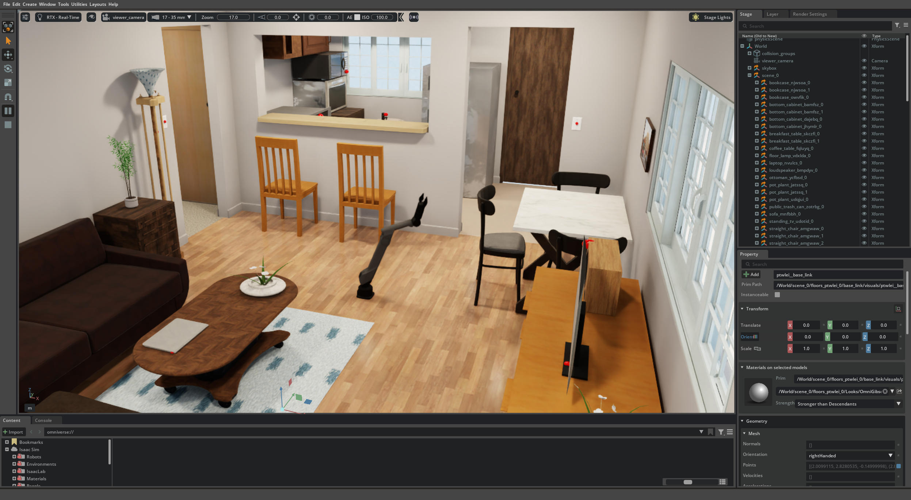

# Isaac Lab Experience

NVIDIA Isaac Sim 和 Isaac Lab 学习与实践项目，包含完整的机器人仿真、强化学习和运动规划示例。

---

## 🤖 架构侧 VLA：一个 GR00T N1.7 → SONIC WBC motion-token → 多动作 G1

_One prompt-conditioned GR00T N1.7 emits a 64-dim SONIC motion token; the pretrained SONIC whole-body controller decodes it into balanced 29-DoF G1 motion — dance / kick / squat / lunge / macarena / jump / walk_

https://github.com/user-attachments/assets/57b8a651-7943-494c-a361-a0e77a0926f4

同一个 GR00T 模型，换 prompt 就出不同动作：VLA **不直接吐关节**，只吐 SONIC 的 64 维 FSQ motion token，预训练 WBC 当现成平衡底座兜底，G1 不摔。闭环 live 已跑通——GR00T (transformers 4.57.3 venv) 起 ZMQ server，Isaac (conda) 端独立 wire client，跨两套 venv，**无 C++ / DDS**。
_One model, prompt-switched motions. The VLA never emits joints — only SONIC's 64-dim motion token; the WBC keeps balance. The closed loop bridges two venvs over ZMQ — no C++/DDS._

- **架构 / Arch**：prompt → GR00T N1.7 (2.5 Hz, ego-view + joint state) → `action.motion_token` (64) → SONIC decoder (50 Hz) → 29-DoF G1
- **数据 / Data**：SONIC deploy demo → 录 token → LeRobot v2.1（7 动作 · 3815 帧）— [`wsagi/SONIC-VLA-LeRobot`](https://huggingface.co/datasets/wsagi/SONIC-VLA-LeRobot)
- **训练 / Train**：冻结 VLM，训 DiT 头 + projector（1.62B 可训），单 4090 × 8000 步；open-loop token MSE **0.0011**，比 per-motion-mean 基线 (0.039) 低 **35×**
- **入口 / Entry point**：📓 [SONIC.ipynb](./SONIC.ipynb)（④ 区自训全流程一键）+ 📄 [`doc/groot_sonic_wbc_route.html`](./doc/groot_sonic_wbc_route.html) · [`doc/sonic_vla_closeloop_validation.html`](./doc/sonic_vla_closeloop_validation.html)
- **HF model card / weights**：[`wsagi/GR00T-N1.7-G1-SONIC`](https://huggingface.co/wsagi/GR00T-N1.7-G1-SONIC)（checkpoint-8000 + 7 闭环 demo mp4）

### 闭环 7 动作（dpose = 查询间关节位移 L2，判动/不动）

| Motion | 闭环自持 / Closed-loop | 备注 / Note |
|---|---|---|
| squat · lunge · dance · macarena | 🟢 自持（dpose 1.5–2.5） | 单帧 obs 即可延续相位 |
| jump | 🟡 边缘 | 有 settle 倾向 |
| kick · walk | 🟠 需 bootstrap | 一次性动作；`BOOTSTRAP=80` 触发式起步 → kick dpose 0.06→**1.42** |

> **血缘 / Lineage**：`bones-studio/seed → nvidia/GEAR-SONIC → wsagi/SONIC-VLA-LeRobot → wsagi/GR00T-N1.7-G1-SONIC`
>
> **诚实边界 / Honest scope**：当前为 7-ep 训练集（MSE 极低但 **held-out 泛化未测**，存在过拟合）；kick/walk 这类一次性动作闭环需触发式 bootstrap 起步；平衡兜底依赖 SONIC WBC 栈（VLA 本身不保证不摔）。

---

## 🕺 Humanoid Motion-Tracking：MimicKit × Unitree G1 × LAFAN1

_Unitree G1 (29-DoF) learns LAFAN1 mocap clips via MimicKit DeepMimic PPO — fight / run / dance / jumps_

https://github.com/user-attachments/assets/61569673-657c-472e-ac9f-18741b53812c

单卡 4090 24G，4096 envs × 1500 PPO iters，每个 motion 约 1 小时跑完；4 个 motion 共享一套 hyperparams + USD per-link 材质修复脚本。
_One 4090, 4 motions, single recipe — drop-in MimicKit + restored per-link USD material._

- **数据 / Data**：LAFAN1 mocap → Unitree-style G1 retarget ([`lvhaidong/LAFAN1_Retargeting_Dataset`](https://huggingface.co/datasets/lvhaidong/LAFAN1_Retargeting_Dataset)) → IsaacLab repack ([`ember-lab-berkeley/LAFAN-G1`](https://huggingface.co/datasets/ember-lab-berkeley/LAFAN-G1)) → 450-frame 中段切段（15 s @ 30 fps）
- **算法 / Algo**：DeepMimic PPO (MimicKit default), action_std=0.05, SGD lr=1e-4
- **入口 / Entry point**：📓 [MimicKit.ipynb](./MimicKit.ipynb) + 📄 [`doc/mimickit_lafan_training.html`](./doc/mimickit_lafan_training.html)
- **HF model card / weights**：[`wsagi/MimicKit-G1-LAFAN`](https://huggingface.co/wsagi/MimicKit-G1-LAFAN)（4 ckpt + textured USD + 4 demo mp4）

### Motion Results

| Motion | Episode-Length (终态 / 15 s 满分) | Ship quality | Source slice |
|---|---|---|---|
| **fight** | 14.85 s · **99.0 %** | 🟢 触顶 | LAFAN `fight1_subject2` [600:1050] |
| **dance** | 14.70 s · **98.0 %** | 🟢 触顶 | LAFAN `dance1_subject1` [1746:2196] |
| **jumps** | 14.70 s · **98.0 %** | 🟢 触顶 | LAFAN `jumps1_subject1` [3441:3891] |
| **run**   |  9.45 s · **63.0 %** | 🟡 plateau | LAFAN `run1_subject2` [3341:3791] |

> 3/4 触顶，`run` 在 63 % plateau — vanilla DeepMimic 在快速接触/滑步段饱和，候选改造方向 ADD residual / motion curriculum。
>
> **附带修复（独立 reusable）**：`scripts/g1_usd_recolor.py` — MimicKit 自带 `g1.usd` 在 USD 转换时把 MJCF per-geom `rgba` 压成单一 `DefaultMaterial=(1,1,1)` 白；脚本反推 `g1.xml` 重绑 36 mesh 双色（深灰 joints + 浅灰 panels），还原 Unitree G1 原色。`export MIMICKIT_G1_USD=$PWD/.../g1_textured.usd` 即生效。

---

## ✨ VLA 推理实测：LeIsaac SO-101 PickOrange

_VLA Inference Benchmark — strict 20-round on SO-101 PickOrange_

https://github.com/user-attachments/assets/44205148-1fa0-4b33-8f60-7a079faf9840

多个开源 VLA 通过 ZMQ 远程推理服务接入 LeIsaac SO-101 Isaac Sim，对比同一 PickOrange 任务表现 + 自训 ACT / DP / SmolVLA / X-VLA / StarVLA / OpenVLA / π0.5 / GR00T-N1.6 横评。
_Compare open-source VLA policies + our fine-tunes on the same task via remote inference servers._

- **任务 / Task**：`Pick up the orange and place it on the plate` (3 oranges)
- **机器人 / Robot**：SO-101 follower (5 关节 + gripper) · **观测**：front + wrist cam (480×640 RGB) + joint state
- **入口 / Entry point**：📓 [LeIsaac.ipynb](./LeIsaac.ipynb) — 每子章节一键 cell

### Strict 20-round Leaderboard

_20 episodes × 3 oranges = **60 oranges total** per row. Sort: E(🍊)/ep DESC. Full distribution + per-episode raw data: [`scripts/benchmark/STRICT_LEADERBOARD.md`](./scripts/benchmark/STRICT_LEADERBOARD.md)._

| Rank | Model                                                                                                                              | Params | **E(🍊)/ep** | P(3) | P(≥2) | Avg ep  | Peak VRAM |
|---|---|---|---|---|---|---|---|
| 🥇 | [`wsagi/GR00T-N1.7-PickOrange`](https://huggingface.co/wsagi/GR00T-N1.7-PickOrange) **自训 / ours** (h=40)                            | ~3B    | **68.3%** | 50% | 70% | 117s | 17.3 GB |
| 🥈 | [`hi-space/GR00T-N1.7-3B-Pick-Orange`](https://huggingface.co/hi-space/GR00T-N1.7-3B-Pick-Orange) (h=40)                              | ~3B    | 66.7%     | 45% | 70% | 102s | 17.3 GB |
| 🥉 | [`LightwheelAI/leisaac-pick-orange-v0`](https://huggingface.co/LightwheelAI/leisaac-pick-orange-v0) (N1.5, h=16)                      | ~3B    | 58.3%     | 40% | 65% | 47s  | 13.8 GB |
| 4  | [`hi-space/GR00T-N1.6-3B-Pick-Orange`](https://huggingface.co/hi-space/GR00T-N1.6-3B-Pick-Orange) (h=40)                              | ~3B    | 48.3%     | 25% | 40% | 87s  | 14.9 GB |
| 5  | [`wsagi/GR00T-N1.6-PickOrange`](https://huggingface.co/wsagi/GR00T-N1.6-PickOrange) **自训 / ours** (ckpt-6500, h=40)                  | ~3B    | 46.7%     | 20% | 45% | 66s  | 14.9 GB |
| 6  | [`wsagi/ACT-PickOrange`](https://huggingface.co/wsagi/ACT-PickOrange) **自训 / ours** (lerobot v0.4.0 ckpt-18k, h=70)                  | ~52M   | 43.3%     | 30% | 40% | 151s | 9.5 GB  |
| 7  | [`wsagi/StarVLA-PickOrange`](https://huggingface.co/wsagi/StarVLA-PickOrange) **自训 / ours** (QwenGR00T freeze-VLM, step-18k, h=16)    | ~4B    | 35.0%     | 10% | 35% | 170s | 16.7 GB |
| 8  | [`shadowHokage/act_policy`](https://huggingface.co/shadowHokage/act_policy) (h=70)                                                    | ~52M   | 28.3%     | 10% | 20% | 169s | 8.6 GB  |
| 9  | [`edge-inference/smolvla-so101-pick-orange`](https://huggingface.co/edge-inference/smolvla-so101-pick-orange) (h=50)                  | ~450M  | 25.0%     | 0%  | 20% | 179s | ~23 GB  |
| 10 | [`wsagi/SmolVLA-PickOrange`](https://huggingface.co/wsagi/SmolVLA-PickOrange) **自训 / ours** (main=15k, h=50)                         | ~450M  | 25.0%     | 0%  | 15% | 176s | ~24 GB  |
| 11 | [`wsagi/X-VLA-PickOrange`](https://huggingface.co/wsagi/X-VLA-PickOrange) **自训 / ours** (weakaug 17k, h=32)                          | 0.9B   | 6.7%      | 0%  | 0%  | 118s | 11.8 GB |

> **Avg ep** = 平均每 episode wall-clock 时长（s），含 server inference + sim step；越短 = policy 越果断（早完成 or 早 stuck-out）。
> **Peak VRAM** = `nvidia-smi` 总 GPU 内存峰值（含 Isaac Sim ~5-6 GB baseline + policy server）。
>
> **E(🍊)/ep** = 每 episode 期望放置橙子数（满分 3）= total_oranges / N_episodes。
> **P(k)** = single-episode placed=k 的概率；**P(≥2)** = 单 ep 至少 2 颗。
>
> _3 个 0/60 entries (DP / OpenVLA / π0.5 自训) 见完整榜单 [`scripts/benchmark/STRICT_LEADERBOARD.md`](./scripts/benchmark/STRICT_LEADERBOARD.md)。_

> **Strict counting**: snapshot at episode end — pre-step obs（避 auto-reset 假阴）+ dz_max=0.20 stacking-aware + plate_r=0.10 cylindrical + velocity-settled gate。
>
> **Why 20 rounds**: 5-round σ ≈ ±6.4% (Bernoulli)，14/15 实测是 4σ outlier；20-round 单 ep 级 noise ≈ ±10%，可信对比。

复现：

```bash
ONLY=gr00t-n17,gr00t-n16-self,act-self STRICT_ROUNDS=20 \
    bash scripts/benchmark/run_all_strict.sh
python3 scripts/benchmark/aggregate_strict_leaderboard.py \
    --results_dir results/benchmark \
    --out scripts/benchmark/STRICT_LEADERBOARD.md
```

### 关键 Findings

- **GR00T 系列三连霸**：N1.7 (68.3%) ≈ hi-space N1.7 (66.7%)；N1.5 LightwheelAI 58.3% 仍能打；自训 N1.6 ckpt-6500 (46.7%) 接近 hi-space N1.6 (48.3%)。
- **ACT 自训 (43.3%) > shadowHokage (28.3%) 53%**：锁版本 lerobot **v0.4.0** + ckpt-18k h=70 重训。原因 = v0.5 dataloader 行为漂移 (PR #3406 + #3442)；详见 [`LeIsaac/docs/training/act_framework_drift.html`](./LeIsaac/docs/training/act_framework_drift.html)。
- **DP / OpenVLA / π0.5 自训 全 0/60**：50-60 demo 不够支撑这些 model class。DP 另有 lerobot async server bug — `predict_action_chunk` 不 `populate_queues`，已在 `lerobot-v040` editable 一行 patch 修复。
- **X-VLA weakaug 17k 6.7%**：之前 single-run 9/18 是 small-N variance，strict 20-round 真实 P(≥1)=20%, P(≥2)=0%。
- **StarVLA 自训 35.0% (step-18k)**：QwenGR00T 冻 VLM 只训 flow-matching head（云端 4080-32G）。云端 sweep 出倒 U 过拟合曲线，峰值 ~15k 步、>21k 塌陷（手臂晃动悬停）。主死因是慢（17/20 轮撞 180s 墙钟没放完 3 颗），非乱动。3-round 虚高 33% → strict 20-round 真值 P(3)=10%。提分杠杆 = 解冻 VLM 顶层 / 加 demo。

- **GR00T 多 release env 隔离**：N1.5 / N1.6 / N1.7 各独立 submodule + venv (transformers 4.51.3 vs 4.57.3 ABI 冲突)；见 [`doc/gr00t_multi_release_env_split.html`](./doc/gr00t_multi_release_env_split.html)。


### Servers / inference infra

| Server                                    | Backend                           | Port | Hosts                                                          |
| ----------------------------------------- | --------------------------------- | ---- | -------------------------------------------------------------- |
| `run_gr00t_server.py`                   | GR00T N1.6 / N1.7 (flow-matching) | 5555 | hi-space/GR00T-N1.6 · hi-space/GR00T-N1.7 · wsagi/GR00T-N1.6 |
| `inference_service.py`                  | GR00T N1.5 (DiT diffusion)        | 5555 | LightwheelAI/leisaac-pick-orange-v0                            |
| `lerobot.async_inference.policy_server` | LeRobot generic                   | 8080 | ACT / SmolVLA / DP (runtime ckpt switch via client)            |

GR00T 系列共用 :5555 (one-at-a-time)；LeRobot async :8080 与 GR00T 互不干扰。
_GR00T variants share ZMQ :5555 (one-at-a-time); LeRobot async server on :8080 coexists with GR00T._

### 实测结论 — 共同 OOD bottleneck

_Test results — shared OOD bottleneck_

三个独立架构（**ACT 回归 / SmolVLA VLM / DP 扩散**）在 60-episode `leisaac-pick-orange` 数据集上都卡在 **第三颗橙子 / late second**：每集只有 1 次"放最后一颗"演示，三个模型共同 OOD。**不是单一模型问题**，是数据分布问题。
_Three independent architectures (ACT regression / SmolVLA VLM / DP diffusion) all stall on the **3rd orange / late 2nd** when fine-tuned on the 60-episode `leisaac-pick-orange` dataset — a shared OOD bottleneck driven by only one "place last orange" demo per episode, not a per-model failure._

- **DP 推理速度根因 / DP latency root cause**：DDPM 100-step 串行采样（不是模型大）。无重训直接 `noise_scheduler_type: DDPM → DDIM` + `num_inference_steps: 32` hot-swap，inference 393ms → 147ms，slowdown 2.96x → 1.1x，4090 上跑得动。
  _DP slowness ≠ model size, but DDPM 100-step serial sampling. Hot-swap ckpt config `DDPM → DDIM` (32 steps) without retraining: 393→147 ms/chunk, 2.96x→1.1x slowdown, real-time on RTX 4090._
- **Eval timeout 哲学 / Timeout philosophy**：`user_patience_cap = startup + n_rounds × 90s`（GR00T baseline 30s × 3 容差），不按推理速度放水。慢模型 = 不适合实时部署，让它失败就好。
  _Use a user-patience cap (`startup + n_rounds × 90s`), not an inference-stretched budget. Slow models should fail-fast as a deployability signal, not be accommodated._
- **设计文档 / Design docs**（in our LeIsaac fork [vitorcen/LeIsaac](https://github.com/vitorcen/LeIsaac)）：
  - [`docs/training/dp_inference_speedup_and_dynamic_timeout.html`](https://github.com/vitorcen/LeIsaac/blob/main/docs/training/dp_inference_speedup_and_dynamic_timeout.html) — DDIM swap + 动态 timeout 完整 postmortem（含 SVG 拟合曲线）
  - [`docs/training/act_eval_debug_postmortem.html`](https://github.com/vitorcen/LeIsaac/blob/main/docs/training/act_eval_debug_postmortem.html) — ACT eval 三个 sim-side 根因 (sim_warmup / step_hz / action_horizon)

### 自训配方与脚本

_Our training recipes and scripts — see [vitorcen/LeIsaac](https://github.com/vitorcen/LeIsaac) fork_

| 模型 / Model | 训练入口 / Launcher (in fork)                                                            | 关键配方 / Recipe                                                               |
| ------------ | ---------------------------------------------------------------------------------------- | ------------------------------------------------------------------------------- |
| ACT          | `scripts/training/act/train.sh`                                                        | chunk_size=100, batch=8, lr=1e-5, 10k steps, no augmentation                    |
| DP           | `scripts/training/diffusion_policy/train.sh`                                           | UNet 1D + ResNet18 vision，**train-from-scratch**，DDIM 32-step inference |
| SmolVLA      | `scripts/finetune/smolvla/prepare_base.sh` → `scripts/finetune/lerobot_finetune.sh` | finetune SmolVLM2 backbone，60 ep 不够拟合 / underfit                           |
| π0.5        | `scripts/finetune/openpi/pytorch/train.sh`                                             | LoRA on Gemma-2B 主干，cumulative 5000 + phased sampler 续训                    |

> 训练目录按语义分：`scripts/finetune/` = 有 pretrained base（fine-tune），`scripts/training/` = 从头训练（train-from-scratch）。
> _Convention: `scripts/finetune/` = fine-tune from a pretrained base; `scripts/training/` = train-from-scratch._

### 推理基础设施

_Inference infrastructure_

- **HF 默认 cache**：所有 ckpt 落 `~/.cache/huggingface/hub/`，`AutoModel.from_pretrained("repo_id")` 直接命中
- **统一 server 管理**：`scripts/policy_server.sh start|stop {gr00t-n15|gr00t-n16|lerobot} [MODEL_PATH]`
- **通用 HF 下载器**：`scripts/download_hf_model.sh REPO_ID`（基于 `hf download`，幂等）
- **client 端自动适配**：`policy_inference.py` 会读 ckpt 的 `config.json` 推断 image feature 名字，避免 SmolVLA base 时代的 `camera1/2/3` 硬编码污染 fine-tune 路径
- **LeIsaac submodule patch 维护**：`patches/leisaac/*.patch` + `scripts/apply_leisaac_patches.sh`（幂等 apply）

详细命令、坑点、conda env 配置见 [`scripts/README.md`](./scripts/README.md)。

---

## ✨ BEHAVIOR-1K 场景与机器人 Zoo

_BEHAVIOR-1K scene & robot gallery — one-click demo notebook_



斯坦福 BEHAVIOR-1K + OmniGibson 在 Isaac Sim 5.1 上的「一键启动」演示集。截图：双臂机器人放在 **Rs_int Full load** 客厅里（沙发 / 茶几 / 早餐桌 / 椅子 / 书柜 / 盆栽 …），右侧 Stage 列出本场景里的所有 USD 对象（`bookcase_njwsoa_0`、`breakfast_table_skczft_0`、`coffee_table_fqluyq_0` … —— B-1K 标准物体命名）。

**亮点**：

- **1018 个 BDDL 任务定义**：从 `boil_water` 到 `putting_dishes_away_after_cleaning`，每个都有符号化的 pre/post-condition，env 自动算 reward/done
- **完整可交互场景**：50+ 整套住宅 / 商业空间（Rs_int、Beechwood、grocery_store_cafe …），所有家具/物体可抓可移
- **14 款内置机器人**：Franka / UR5e / Kinova / vx300s / A1(PiPER) 机械臂、R1/R1Pro 双臂人形、Tiago/Stretch/Fetch 移动操作、Husky/TurtleBot/LoCoBot/Freight 移动底盘
- **语义状态系统**：物体不只有几何/物理，还有 `sliced` / `cooked` / `wet` / `on-fire` / `folded` …，靠 transition rules 在仿真中切换
- **GPU 粒子**：水流 / 喷雾 / 灰尘 / 火焰 真实流体

**一键 demo gallery**：📓 [BEHAVIOR-1K.ipynb](./BEHAVIOR-1K.ipynb)

按分类组织（每个 cell 一行 `!python scripts/b1k_demo.py launch <name>`）：

- `0. Setup` — 数据集下载/初始化（30 GB，幂等）
- `1. 场景浏览` — Rs_int / Beechwood_0_int / house_single_floor / grocery_store_cafe
- `2. 机器人操作 demo` — Fetch grasping + 控制器演示
- `3. Robot Zoo` — 14 款机器人按 机械臂 / 人形 / 移动操作 / 移动底盘 分组
- `4. 语义对象状态` — slicing / fire / heating / water particles / cloth fold / attachment
- `5. 物体可视化` / `6. 环境导航` / `7. 训练数据 (Challenge demos)`

**前置**：

- `behavior` conda env（含 `isaacsim[all,extscache]==5.1.0` + 改装到 `torch 2.6.0+cu124`）
- NVIDIA driver **≥ 580**（驱动 550 + 内核 6.17 会因模块缺失起不来；595 与 Isaac Sim 5.1 的 RTX 渲染器有 segfault；**580 是当前最稳的版本**）
- 30 GB 磁盘给 `BEHAVIOR-1K/datasets/behavior-1k-assets/`

底层脚本：[`scripts/b1k_demo.py`](./scripts/b1k_demo.py)（注册表 + CLI）、[`scripts/launch_b1k_scene.py`](./scripts/launch_b1k_scene.py)（场景）、[`scripts/launch_robot.py`](./scripts/launch_robot.py)（机器人 zoo）、[`scripts/launch_demo.py`](./scripts/launch_demo.py)（通用 OG example wrapper，patch `input()` 跳过交互菜单）。

---

## 快速体验（无需训练）

无需训练，直接运行预训练策略观察机器人行为。

### 🦎 四足机器人 — ANYmal-C 在崎岖地形行走


### 🚶 人形机器人 — Unitree G1 行走


### 其他可用演示

- **倒立摆平衡**（Cartpole）：经典控制任务，最快上手
- **四足运动**：ANYmal-C/D、Ant、Unitree A1/Go1/Go2
- **人形运动**：Unitree G1/H1、Humanoid、AMP 基于运动先验的自然运动
- **灵巧手操作**：Shadow Hand、Allegro Hand 物体操作
- **机械臂任务**：Franka 开柜子
- **飞行器**：Quadcopter 悬停和位置控制

### 一键运行

```bash
conda activate isaaclab
cd dependencies/IsaacLab && python scripts/reinforcement_learning/rsl_rl/play.py \
    --task Isaac-Cartpole-Direct-v0 \
    --use_pretrained_checkpoint \
    --num_envs 64
```

快速体验（预训练策略，无需训练）：

- 📓 [LeIsaac.ipynb](./LeIsaac.ipynb) — **LeIsaac SO-101 PickOrange VLA 推理对比**（GR00T N1.5/N1.6/N1.7 + LeRobot ACT/SmolVLA）
- 📓 [DEMO.ipynb](./DEMO.ipynb) — 通用 server 后台启动 + GR1 robocasa tabletop demo

完整演示列表和使用说明见：

- 📘 [SCRIPTS.md](./SCRIPTS.md) — Markdown 文档
- 📓 [SCRIPTS.ipynb](./SCRIPTS.ipynb) — 可直接执行的 Jupyter notebook

---

## 核心功能

### Isaac Lab

- **机器人模型库**: 16+ 常见机器人模型（机械臂、四足、人形等）
- **预配置环境**: 30+ 可直接训练的强化学习环境
- **物理仿真**: 刚体、铰接系统、可变形物体
- **传感器**: RGB/深度/分割相机、IMU、接触传感器、光线投射器
- **RL 框架集成**: RSL RL、SKRL、RL Games、Stable Baselines
- **多智能体支持**: 多智能体强化学习

### Isaac Sim

- **资产导入**: URDF、MJCF、CAD 格式支持
- **机器人调优**: 物理精度、计算效率、真实感优化
- **机器人仿真**: 控制器、运动生成、运动学求解器
- **RTX 传感器**: 基于光线追踪的高保真传感器仿真
- **ROS 集成**: ROS/ROS2 桥接支持
- **合成数据生成**: 用于训练 AI 模型的数据生成工具

---

## 系统要求

### 硬件要求

**本地工作站（最低配置）**：

- GPU: NVIDIA RTX 4080 或更高
- 推荐: RTX 5080 / RTX 5880 Ada
- 最佳: RTX PRO 6000 Blackwell Workstation

**数据中心（最低配置）**：

- GPU: NVIDIA A40 或更高
- 推荐: L40S / L20
- 最佳: RTX PRO 6000 Blackwell Server

### 软件要求

- **操作系统**: Ubuntu 22.04 / Ubuntu 24.04（需要 GCC/G++ 11）
- **Python**: 3.11
- **驱动**: 最新 NVIDIA 驱动（参考 [NVIDIA 驱动要求](https://docs.omniverse.nvidia.com/dev-guide/latest/common/technical-requirements.html)）
- **Git** 和 **Git LFS**
- **build-essential**: 包含 make 等构建工具

---

## 安装依赖

### 1. 安装基础工具

```bash
sudo apt-get update
sudo apt-get install build-essential
sudo apt-get install git-lfs
git lfs install
```

### 2. 安装 GCC/G++ 11（Ubuntu 24.04 必需）

```bash
sudo apt-get install gcc-11 g++-11
sudo update-alternatives --install /usr/bin/gcc gcc /usr/bin/gcc-11 200
sudo update-alternatives --install /usr/bin/g++ g++ /usr/bin/g++-11 200
```

### 3. 验证编译器版本

```bash
gcc --version
g++ --version
```

---

## 快速开始

有两种安装方式：**pip 安装（推荐）** 或 **源码构建**。

### 方式一：pip 安装 Isaac Sim（推荐）

这是最简单快速的方式，使用 NVIDIA 官方的 pip 包。

#### 1. 克隆项目

```bash
git clone <your-repo-url> isaaclab-experience
cd isaaclab-experience
```

#### 2. 初始化 IsaacLab Submodule

```bash
git submodule update --init --recursive IsaacLab
```

#### 3. 创建 Conda 环境

Isaac Sim 需要 Python 3.11：

```bash
conda create -n isaaclab python=3.11 -y
conda activate isaaclab
```

#### 4. 安装 Isaac Sim pip 包

```bash
pip install isaacsim-rl isaacsim-extscache-physics isaacsim-extscache-kit-sdk isaacsim-extscache-kit \
    --extra-index-url https://pypi.nvidia.com
```

> **重要**：
>
> - 确保 conda 环境已激活
> - 首次安装会下载约 5-10 GB 数据，需要稳定网络
> - 安装时间取决于网络速度，通常 10-30 分钟

#### 5. 安装 Isaac Lab

```bash
cd dependencies/IsaacLab
./isaaclab.sh --install
```

#### 6. 验证安装

```bash
python scripts/reinforcement_learning/rsl_rl/train.py --task Isaac-Cartpole-Direct-v0
```

---

### 方式二：源码构建 Isaac Sim

如果需要修改 Isaac Sim 源码，使用此方式。

#### 1. 克隆项目并初始化所有 Submodules

```bash
git clone <your-repo-url> isaaclab-experience
cd isaaclab-experience
git submodule update --init --recursive
```

#### 2. 构建 Isaac Sim

```bash
cd dependencies/IsaacSim
./build.sh
```

> 注意：
>
> - 构建需要互联网连接
> - 需要 20+ GB 磁盘空间
> - 构建时间：1-3 小时（首次）

#### 3. 创建符号链接

构建完成后，需要在 IsaacLab 中创建指向 Isaac Sim 构建输出的符号链接：

```bash
cd ../IsaacLab
ln -s ../IsaacSim/_build/linux-x86_64/release _isaac_sim
```

#### 4. 安装 Isaac Lab

```bash
./isaaclab.sh --install
```

#### 5. 验证安装

```bash
./isaaclab.sh -p scripts/reinforcement_learning/rsl_rl/train.py --task Isaac-Cartpole-Direct-v0
```

---

## 项目结构

```
isaaclab-experience/
└── dependencies/              # 第三方依赖（submodules）
    ├── IsaacLab/              # Isaac Lab 源码（submodule）
    │   ├── source/            # 核心源码
    │   ├── apps/              # 应用程序
    │   └── docs/              # 文档
    └── IsaacSim/              # Isaac Sim 源码（submodule）
        ├── source/            # 核心源码
        ├── tools/             # 工具集
        └── docs/              # 文档
```

---

## 官方文档

### Isaac Lab

- [官方文档](https://isaac-sim.github.io/IsaacLab)
- [安装指南](https://isaac-sim.github.io/IsaacLab/main/source/setup/installation/index.html)
- [强化学习教程](https://isaac-sim.github.io/IsaacLab/main/source/overview/reinforcement-learning/rl_existing_scripts.html)
- [可用环境列表](https://isaac-sim.github.io/IsaacLab/main/source/overview/environments.html)
- [API 文档](https://isaac-sim.github.io/IsaacLab/main/source/api/index.html)

### Isaac Sim

- [官方文档](https://docs.isaacsim.omniverse.nvidia.com/latest/index.html)
- [快速入门教程](https://docs.isaacsim.omniverse.nvidia.com/5.1.0/introduction/quickstart_index.html)
- [资产库](https://docs.isaacsim.omniverse.nvidia.com/5.1.0/assets/usd_assets_overview.html)
- [ROS2 集成](https://docs.isaacsim.omniverse.nvidia.com/5.1.0/ros2_tutorials/ros2_landing_page.html)

---

## 常见问题

### Conda 环境冲突导致 cmake 错误

**现象**：运行 `./isaaclab.sh --install` 时出现 `ModuleNotFoundError: No module named 'cmake'`。

**原因**：conda 环境中的 cmake 包装器与系统 cmake 冲突。

**解决方案**：

1. **方案一（推荐）**：确保 conda 环境已激活

   ```bash
   conda activate isaaclab
   cd dependencies/IsaacLab
   ./isaaclab.sh --install
   ```
2. **方案二**：如果仍然失败，临时退出 conda 使用系统环境：

   ```bash
   conda deactivate
   # 注意：只有在 pip 安装方式下才需要 conda 环境
   ```

### Isaac Lab 找不到 Isaac Sim 环境

**现象**：提示 `Unable to find any Python executable at path: '_isaac_sim/python.sh'`。

**原因**：Isaac Sim 未安装或 conda 环境未激活。

**解决方案**：

- **pip 安装**：确保已安装 `isaacsim-rl` 且 conda 环境已激活

  ```bash
  conda activate isaaclab
  pip list | grep isaacsim
  ```
- **源码构建**：确保 IsaacSim 已构建完成

  ```bash
  cd dependencies/IsaacSim
  ./build.sh
  ```

### 编译器版本问题（源码构建）

如果构建时提示编译器版本不兼容，可以：

1. **使用 GCC/G++ 11**（推荐）
2. **跳过版本检查**（风险自负）：
   ```bash
   ./build.sh --skip-compiler-version-check
   ```

### Submodule 未初始化

如果运行脚本时提示找不到目录：

```bash
git submodule update --init --recursive
```

### GPU 驱动问题

确保安装了最新的 NVIDIA 驱动（推荐 550+）：

```bash
nvidia-smi
sudo apt-get install nvidia-driver-550 nvidia-utils-550
```

如果显示错误，参考 [NVIDIA 驱动安装指南](https://docs.nvidia.com/datacenter/tesla/tesla-installation-notes/index.html)。

---

## Docker 支持

使用 Docker 可以避免环境配置问题：

### 安装 Docker 和 NVIDIA Container Toolkit

```bash
curl -fsSL https://get.docker.com -o get-docker.sh
sudo sh get-docker.sh
sudo usermod -aG docker $USER

distribution=$(. /etc/os-release;echo $ID$VERSION_ID)
curl -s -L https://nvidia.github.io/nvidia-docker/gpgkey | sudo apt-key add -
curl -s -L https://nvidia.github.io/nvidia-docker/$distribution/nvidia-docker.list | sudo tee /etc/apt/sources.list.d/nvidia-docker.list

sudo apt-get update
sudo apt-get install -y nvidia-container-toolkit
sudo systemctl restart docker
```

### 使用 Docker 运行

参考 IsaacLab 和 IsaacSim 目录中的 Docker 相关文档。

---

## 版本兼容性

| Isaac Lab 版本 | Isaac Sim 版本  |
| -------------- | --------------- |
| `main` 分支  | 4.5 / 5.0 / 5.1 |
| `v2.3.X`     | 4.5 / 5.0 / 5.1 |
| `v2.2.X`     | 4.5 / 5.0       |

---

## 贡献

欢迎提交 Issue 和 Pull Request！

- **Isaac Lab**: [贡献指南](https://isaac-sim.github.io/IsaacLab/main/source/refs/contributing.html)
- **Isaac Sim**: [GitHub Issues](https://github.com/isaac-sim/IsaacSim/issues)

---

## 许可证

- **Isaac Lab**: BSD-3-Clause / Apache-2.0
- **Isaac Sim**: Apache-2.0

---

**Happy Robot Learning! 🤖**
